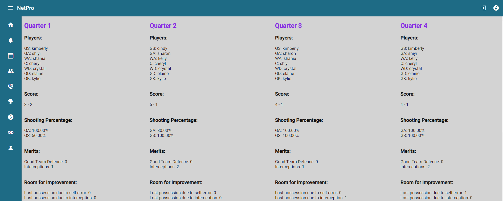
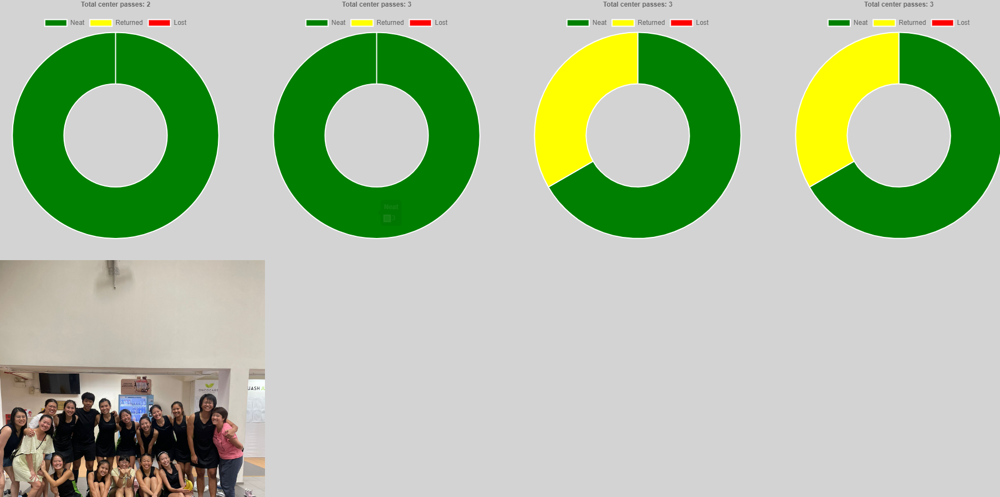
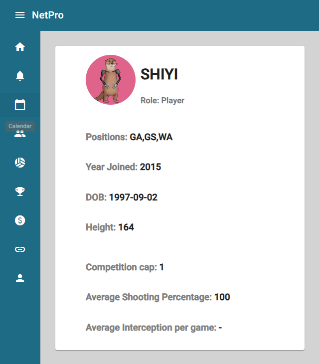
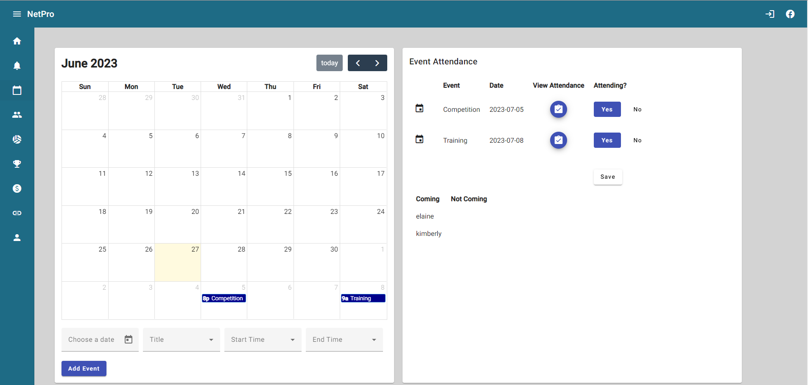
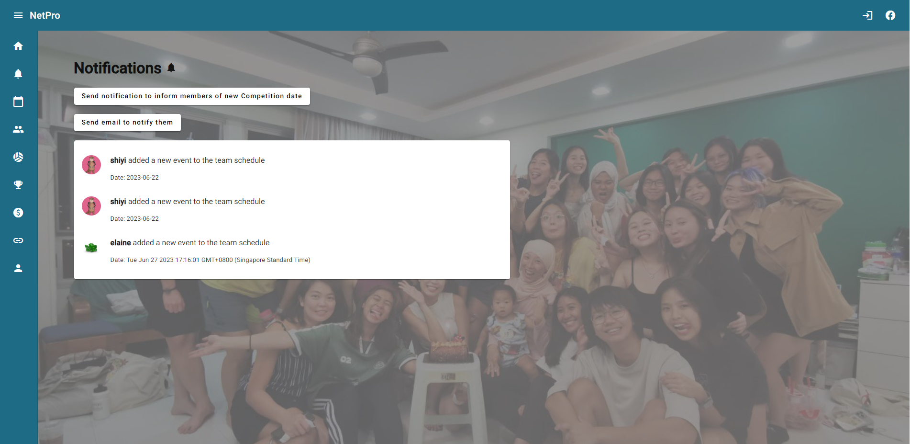
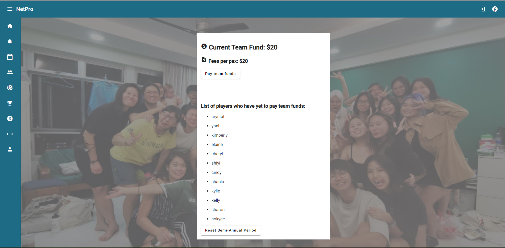
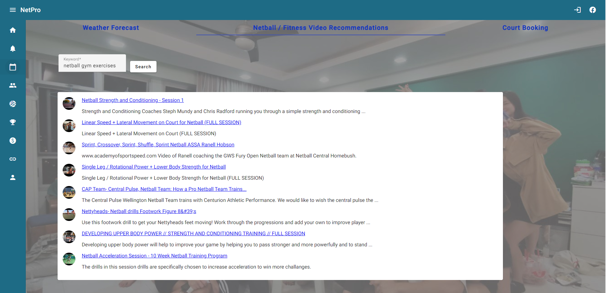

# Mini Project - NetPro (Netball Team Management App)

## Project Description
NetPro is a sports team management app that empowers users with a comprehensive set of features for statistical record-keeping, insightful multi-game analytics and efficient attendance tracking. NetPro also serves as a tool to streamline team management and reduce administrative workload. 

## Project Features
### Record and View Game Statistics

### View Individual Statistics Across Games 

### Add / Delete Event with Attendance Taking
 

 ### Send notifications and email to all members 
 

 ### Track and pay team funds
 

 ### Access a bunch of useful website such as weather forecast, video recommendation, court booking
 

## Technologies Used
### Client Side
* Angular 
* CSS

### Server Side
* Spring Boot

### Persistence
* MySQL 
* Digital Ocean S3

### Deployment 
* Backend Deployment to Railway
* Frontend Deployment to Vercel